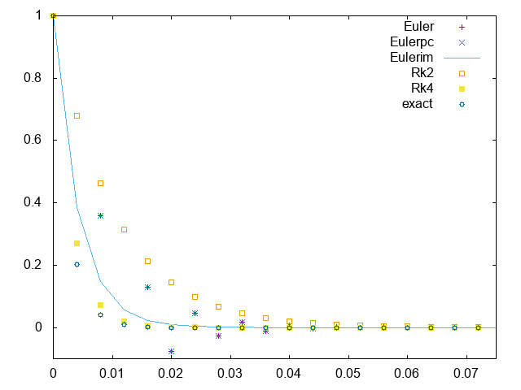
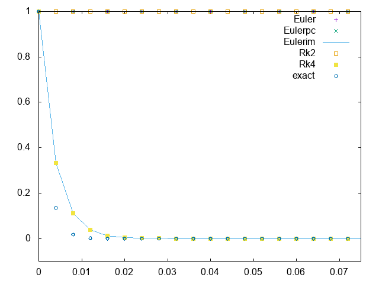
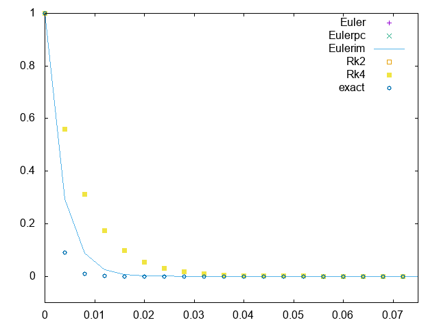
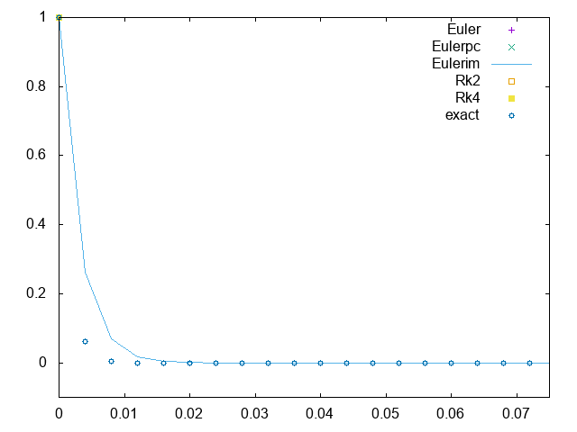

## 关于常微分方程解法的稳定性
---
- 对习题$5.10.7$进行了研究，将数据输出到`data.txt`，然后用`gnuplot`脚本`ex17.plt`画图，结果是令人满意的，可以看到隐式方法的稳定性是很强的，但如果同在稳定域，`rk4`方法精度更高

- 
|  | 
|:--:| 
| *n=500,lambda=-400* |

- 
|  | 
|:--:| 
| *n=500,lambda=-500* |

- 
|  | 
|:--:| 
| *n=500,lambda=-600* |

- 
|  | 
|:--:| 
| *n=500,lambda=-700* |
